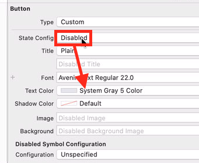

# Disable Relation UIButton If related data is an empty list

## expected result

Some buttons disabled if there is no data to display if you touch the button (no need to make transition to see an empty list)

## Configure

### First your button appareance

Select "disable" state and choose an other color for test or/and for background

For instance

### And the binding

Define binding with the link and special operator `.@count`, binded on `enabled` key

| Key Path | Type | Value |
|-|-|-|
| `bindTo.record.___FIELD___.@count` | String | enabled |

In generated app:

