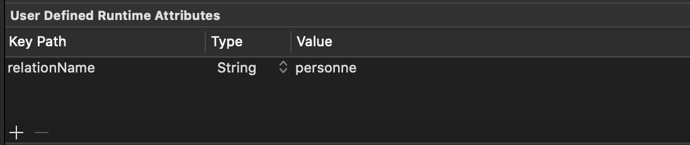

# RelationInfoUI

## How work transitions with relation?

### In code

When transitioning from [DetailForms](DetailsForm.md) to [ListForms](ListForm.md) or [DetailForms](DetailsForm.md) we need to know the relation name.

In [DetailForms](DetailsForm.md) transition is prepared in function

```swift
    open override func prepare(for segue: UIStoryboardSegue, sender: Any?) {
```

The `sender` is the user interface view that trigger the transition.

This `sender` must provide the relation name by implementing the protocol [`RelationInfoUI`](#relationui-code)


> If this `sender` is a button (`UIButton`) or any `UIControl` then nothing to do, all is already implemented. But for a bustom view you must implement it.

### In storyboards

On `sender` the relation is added using User Defined Runtimes attributes



Then a segue must be created from detail form to the destination one using storyboard reference


## RelationUI code

```swift
/// Protocol to provide info on relation
public protocol RelationInfoUI {
    /// Relation object data.
    var relation: Any? { get }
    /// The relation name
    var relationName: String? { get }
    /// The relation format
    var relationFormat: String? { get }
    /// The inverse relation name.
    //var inverseRelationName: String? { get } // CLEAN to remove

    /// Add action to launch segue.
    var addRelationSegueAction: Bool { get }
}
```
