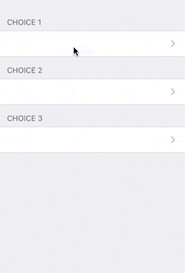

# Create Custom Input Control for Action Parameter

Here we will see how to create it with iOS native code like we provide in [gallery](
https://4d-go-mobile.github.io/gallery/#/type/input-control)

> 💡 You could take one from gallery has starter template

## Content of input control project

### manifest.json

First the manifest describe the name, and the type of data we want to send to server, and some configuration to request code injection

```json
{
    "name": "yourName",
    "type": "text",
    "inject": true,
    "capabilities": {
      "service":  "YourNameRowService"
    }
  }
}
```

### native code

You must provide some swift code for instance defined in path `ios/Sources/Forms/Actions/YourNameRow.swift`

Action parameter widget are based on third party [`Eureka`](https://github.com/xmartlabs/Eureka) framework.

The code could be divided into two parts:

#### According to the input control name provide an Eureka row

For that you must create the `YourNameRowService` class, which implement the protocol `ActionParameterCustomFormatRowBuilder` to build a `Row` according to `format` value, the one defined in manifest.json.

Here an example using standard Eureka DataRow but with a provided date formatter

```swift
import QMobileUI
import Eureka

@objc(YourNameRowService)
class YourNameRowService: NSObject, ApplicationService, ActionParameterCustomFormatRowBuilder {
    @objc static var instance: PhoneContactRowService = PhoneContactRowService()
    override init() {}
    func buildActionParameterCustomFormatRow(key: String, format: String, onRowEvent eventCallback: @escaping OnRowEventCallback) -> ActionParameterCustomFormatRowType? {
        if format == "textDate" {
            // create a row
            let row = DateRow(key)
            row.dateFormatter = DateFormatter.shortDate
            // return it
            return row.onRowEvent(eventCallback) // do not forget to map event to callback
        }
        // do nothing for unknown format (or log it)
        return nil
    }
}
```

#### Create a custom Eureka row

The best is to read [Eureka documentation](https://github.com/xmartlabs/Eureka)


##### some example with location

I want to add a button to get user location. We need to request it. 

```json
{
    "name": "mylocation",
    "type": "text",
    "inject": true,
    "capabilities": {
          "location": true,
          "service": "MyLocationRowService"
    }
}
```

```swift
import QMobileUI
import Eureka
import CoreLocation

@objc(MyLocationRowService)
class MyLocationRowService: NSObject, ApplicationService, ActionParameterCustomFormatRowBuilder {

    func buildActionParameterCustomFormatRow(key: String, format: String, onRowEvent eventCallback: @escaping OnRowEventCallback) -> ActionParameterCustomFormatRowType? {
        if format == "mylocation" {

            return MyLocationRow (key) { row in
                let controllerProvider: ControllerProvider<UIViewController> = ControllerProvider.callback {
                    let controller = MyLocationViewController()
                    controller.modalPresentationStyle = .fullScreen
                    controller.didFinish = { value in
                        row.value = value
                        controller.dismiss(animated: true) {}
                    }
                    return controller
                }
                row.presentationMode = .presentModally(controllerProvider: controllerProvider, onDismiss: { _ in })
            }.onRowEvent(eventCallback)
        }
        return nil

    }
}

// A button to display location and to ask user to request it 
final class MyLocationRow: _ButtonRowOf<String>, RowType {
    public required init(tag: String?) {
        super.init(tag: tag)
    }
    override func customUpdateCell() {
        if let value = value, !value.isEmpty {
            self.cell.textLabel?.text = value
            self.cell.editingAccessoryType = .none
        } else {
            self.cell.textLabel?.text = "Touch to get your locations"
            self.cell.editingAccessoryType = .detailButton
        }
    }
}

// The controller which get location, displayed by button
class MyLocationViewController: UIViewController, CLLocationManagerDelegate {

    var didFinish: (String) -> Void = { _ in }
    var locationManager: CLLocationManager?
    override func viewDidLoad() {
        super.viewDidLoad()

        locationManager = CLLocationManager()
        locationManager?.delegate = self
        locationManager?.requestWhenInUseAuthorization()

        view.backgroundColor = .clear
    }

    func locationManager(_ manager: CLLocationManager, didChangeAuthorization status: CLAuthorizationStatus) {
        switch status {
        case .authorizedAlways, .authorizedWhenInUse:
            locationManager?.requestLocation()
        case .denied, .restricted:
            DispatchQueue.main.async {  [weak self] in
                self?.didFinish("Please go to Settings and turn on the permissions")
            }
        default:
            break
        }

    }

    func locationManager(_ manager: CLLocationManager, didFailWithError error: Error) {
        logger.error("\(error)")
        didFinish("no location authorized")
    }

    func locationManager(_ manager: CLLocationManager, didUpdateLocations locations: [CLLocation]) {
        if let location = locations.first {
            // as a bonus here we get some information about the place as textual info
            // but you could return the lat and long using: self?.didFinish("\(location.coordinate.latitude),\(location.coordinate.longitude)")
            // and not use reverseGeocodeLocation
            let ceo: CLGeocoder = CLGeocoder()
            ceo.reverseGeocodeLocation(location) { [weak self] (placemarks, error) in
                if let error = error {
                    logger.warning("reverse geodcode fail: \(error.localizedDescription)")
                    self?.didFinish("\(location.coordinate.latitude),\(location.coordinate.longitude)")
                } else if let places = placemarks, let place = places.first {
                    let placeInfos = [place.subLocality, place.thoroughfare, place.locality, place.country, place.postalCode]
                    let placeInfo = placeInfos.compactMap({$0}).joined(separator: ", ")
                    self?.didFinish("\(placeInfo):\(location.coordinate.latitude),\(location.coordinate.longitude)")
                }
            }
        } else {
            didFinish("")
        }
    }

}
```

##### Sample with choice dependent on other choices



```swift
import UIKit
import ContactsUI

import Eureka
import QMobileUI

// name of the format
fileprivate let kChoiceShared = "choiceShared"

enum ChoiceShared: String {
    case choice1
    case choice2
    case choice3
    
    var child: Self? {
        switch self {
        case .choice1:
            return .choice2
        case .choice2:
            return .choice3
        case .choice3:
            return nil
        }
    }
}

extension Eureka.Form {
    func row(by: ChoiceShared) -> ChoiceSharedContactRow? {
        return self.rowBy(tag: by.rawValue) as? ChoiceSharedContactRow
    }
}

extension ChoiceShared {
    
    func options(parent: String?) -> [String] {
        switch self {
        case .choice1:
            return ["a", "b", "c", "d"]
        case .choice2:
            switch parent ?? "" {
            case "a":
                return ["1", "2", "3", "4"]
            case "b":
                return ["2", "3", "4", "5"]
            case "c":
                return ["5", "6", "7", "8"]
            case "d":
                return ["10", "20", "30", "40"]
            default:
                return []
            }
        case .choice3:
            switch parent ?? "" {
            case "1" , "2":
                return ["α", "β"]
            case "3", "4", "5":
                return ["γ","δ"]
            case "6", "7", "8":
                return ["ε","ζ"]
            case "10":
                return ["γ","δ", "ε","ζ"]
            case "20":
                return ["γ","δ"]
            case "30", "40":
                return ["γ","δ"]
            default:
                return []
            }
        }
    }
}

// Create an Eureka row for the format
final class ChoiceSharedContactRow: _PushRow<PushSelectorCell<String>>, RowType {

    required public init(tag: String?) {
        super.init(tag: tag)
    }

}
 
@objc(ChoiceSharedRowService)
class ChoiceSharedRowService: NSObject, ApplicationService, ActionParameterCustomFormatRowBuilder {
    @objc static var instance: ChoiceSharedRowService = ChoiceSharedRowService()
    override init() {}
    func buildActionParameterCustomFormatRow(key: String, format: String, onRowEvent eventCallback: @escaping OnRowEventCallback) -> ActionParameterCustomFormatRowType? {
        if format == kChoiceShared {
            let choiceRow = ChoiceSharedContactRow(key)
            
            guard let choiceShared = ChoiceShared(rawValue: key) else {
                logger.warning("Choice unknown key \(key)")
                return nil
            }
            if ChoiceSharedContactRow.defaultCellUpdate == nil {
                ChoiceSharedContactRow.defaultCellUpdate = { cell, row in
                    if let tag = row.tag, let choiceShared = ChoiceShared(rawValue: tag) {
                        logger.info("Row updated \(choiceShared) with value \(row.value ?? "<none>")")
                        /*DispatchQueue.main.async {
                            logger.info("sync Row updated \(choiceShared) with value \(row.value ?? "<none>")")*/
                            if let child = choiceShared.child, let rowChild = cell.formViewController()?.form.row(by: child) {
                                let options = child.options(parent: row.value)
                                rowChild.options = options
                                if rowChild.value == nil || !options.contains(rowChild.value!) { //swiftlint:disable:this force_cast
                                    rowChild.value = "" // or rowChild.options?.first force?
                                    logger.info("Row set \(child) with value \(rowChild.value ?? "<none>")")
                                }
                            }
                       /* }*/
                    }
                }
            }
            choiceRow.options = choiceShared.options(parent: nil)
            
            return choiceRow.onRowEvent(eventCallback)
        }
        return nil
    }
}
```


